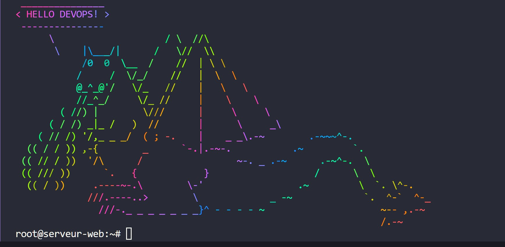

# Automatization-with-Ansible

## ansible and lxd container

1. Installing ansible:
DOC: https://docs.ansible.com/

2. Creating a repository on github

3. Download the repository via git clone on vm, add the ansible folder:
```
  tree

├── README.md
├── Taskfile.yml
├── ansible
│ ├── inventory
│ │ └── dev.yaml
│ ├── playbooks
│ │ └── apache-install.yaml
│ └── roles
│ └── apache-install
│ ├── tasks
│ │ └── main.yaml
│ └── templates
│ └── index.html.j2
└── ansible.cfg
```


***directory with host dev./yaml and configuration in file.cfg***

```
.ansible.cfg host configuration for the dev.yaml file
[defaults]
inventory = ~/ansible/etc/hosts
remote_user = root
```

***creating a role/tasks:***
***organized set of tasks and configurations***

***create playbook:***
***file configured for the apache role/role/task***

***Taskfile.yml installation***

```
doc: https://blog.stephane-robert.info/docs/task/
and life is beautiful!
configuring the file for our tasks
creating an alias for the command that calls playbook
```

***creating the workflows file***

```
.github/workflows/workflows.yaml

github action runners installation

important commands, when idle is inactive add:


actions-runner$ sudo ./svc.sh install
this creates the service, and we can check the status in systemctl
```


4. Creating a container and connecting to Ansible via ssh and host (* dev.yaml file in inventory)
  additional commands:
```
cat .ssh/authorized_keys here we add ssh vm
ls /root/ -alh
ls /root/.ssh/


ls -alh .ssh/
ssh-keygen -b4096
ls -alh .ssh/


lxc file push .ssh/id_rsa.pub ansible/root/.ssh/authorized_keys

ping the container's ip address
ssh container ip address
```

***command to call ***

ansible -i etc/hosts -u root -m ping ansible
in the ansible file in vm:


ansible -m command -a "ip a" ansible or ls or ip a vm will display the information we want to access from the ansible container
- thanks to the configuration in the real ansible file, root uses ansible/etc/hosts


PATH=$PATH:/usr/games
cowsay -f dragon "coucou DEVOPS!" | lolcat -F 0.3 -S 5

